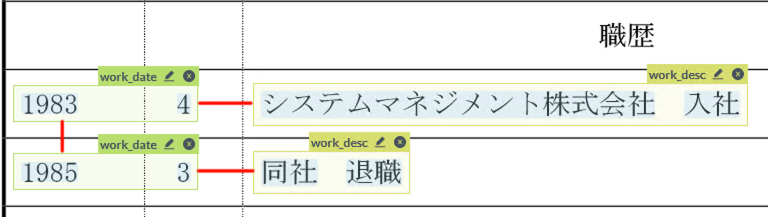

# Labelling Japanese CVs with PAWLS

This documents describes the installation of PAWLS, an annotation tool for PDFs, and the set of standards for labelling Japanese CVs with it. For the original README, please go to [allenai/pawls](https://github.com/allenai/pawls).

## Running PAWLS

### From a remote machine
Simply open `http://192.168.2.56:8080` on your browser.

### Installing it locally
Please first have the latest version of [🐳Docker](https://www.docker.com/get-started/) installed on your local machine.
1. Launch Docker. 
2. Navigate to the directory you want PAWLS to be in.
3. If you're on Windows, run `git config --global core.autocrlf false` in your terminal to fix end-of-line issues.
4. `git clone https://github.com/slo-daxtra/pawls.git`
5. Download the dataset from `https://drive.google.com/drive/folders/1m-c8yhl_Pl7xDDxlaomK2AwojXvtykfF`, and put the contents in `pawls/skiff_files/apps/pawls/papers`, so for example an example folder is located in `pawls/skiff_files/apps/pawls/papers/34889_CV.pages_1_2`.
6. `cd pawls`
7. `docker-compose up --build`

## Labels

Only label the content, and not the heading. For example, for education history, only label the content but not the heading "学歴". If it's impossible (i.e. if they are the same box as the content), then please enable "Free Form Annotations" from the labels section, and please remember note down what labels were free-form, so we could fix the boxes manually afterwards.

* `current_date`: Date of last update for the CV (avoid "現在" if possible)
* `phonetic_name`: Name in furigana
* `family_name`: Self-explanatory
* `given_name`: Self-explanatory
* `nationality`: Usually only for foreigners
* `visa_status`: Usually only for foreigners
* `place_of_birth`: Town or prefecture of origin
* `date_of_birth`: Date of birth excluding "生"
* `age`: Age only including the number (avoid "満" or "歳" if possible)
* `gender`: Self-explanatory
* `phone`: Full phone number, including area code
* `phone_type`: What kind of phone number it is (e.g. "電話", "携帯電話", etc.)
* `email`: Email address
* `postcode`: Post code part of the address (avoid "〒" if possible)
* `address_line`: Main address, excluding the postcode
* `edu_date`: Date of an education history
* `edu_desc`: Description of the education history
* `work_date`: Date of a work history
* `work_desc`: Description of the work history
* `qualif_date`: Date of a qualification
* `qualif_desc`: Description of the qualification history
* `skill`: Skill item, including language
* `hobby`: Hobby, inludes sports
* `commute`: Commute time and closest station (please include headings)
* `dependant`: Number of dependants (excluding spouse)
* `spouse_have`: Whether the applicant has a spouse
* `spouse_support`: Whether the applicant needs to financially support their spouse
* `statement`: Personal statement
* `wish`: The applicant's ideal role
   

## Data structure

1. The files ready to be labelled should be in `pawls/skiff_files/pawls/papers`.
2. Each PDF is a folder, and inside you'll see the original PDF and a file called `pdf_structure.json`, which has information about the PDF and the pre-made boxes you'll be labelling.
3. Once you make an edit on a certain PDF, a file called 

## Start labelling

Once you have PAWLS open, select the file you want to label on the left, below the labels.

### Annotations

1. To make an annotation, select the label you want (either with your mouse, number keys, or left and right arrow keys).
2. Drag on the screen the region you want to label. You don't need to be precise since it'll automatically snap into place to surround the selected text.
3. Repat the above.

If a single element (e.g. a single skill) is divided into two lines because of formatting and cannot be in the same box, tag the two parts with the same class and link them together using the "same" relation according to the next part's instructions.

### Relations

We need to label relations when two or more elements are related, such as `work_date` `work_desc` for the same job. Try not to make mistakes when labelling relations, because they're harder to remove. If you have to remove a relation, you can do so by directly modifying `slo-daxtra_annotations.json` inside the correct folder in `pawls/skiff_files/pawls/papers`.

1. To label and relation, make sure you already have all the annotations.
2. Hold down shift, and click all the relevant labels (e.g. the `work_start` and `work_desc` labels for the same job).
3. When you release the shift key, you'll see a window called "Annotate Relations".
4. Choose the correct relation label ("related" or "same").
5. Put the correct tags on the left and right according to the instructions in the next section, then submit. 

#### `related`

The `related` label should be used to label related elements inside a phone type-number pair, or in an education/work/qualification timeline, as the image shows.

* For date-description pairs, put the date on the left and description on the right. 
* For date pairs, put the earlier date on the left.

#### `same`

The `same` label should be used to label two parts of the same element. The first part should be put on the left.

## Output files
The output is a file called with `slo-daxtra_annotations.json` inside each PDF file's folder. 

## Troubleshooting

### Unable to Render Document
This should happen very rarely. Simply remove the folder from the dataset. 

### Text is blank on the web interface
One example is `121244_CV.pages_1_2`. This is probably a font problem on the browser, not with the file itself. You can have the PDF open and use it as a reference. If you are running PAWLS from another machine, download the same dataset from the installation section above

